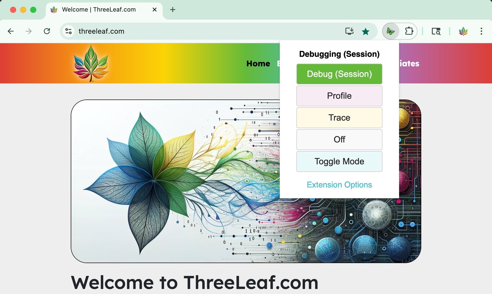

# Xdebug Chrome Extension

  

  <b>The Xdebug Chrome Extension PHP Developers Deserve</b>

  
  
  

---

> **Seamlessly enable Xdebug debugging, profiling, and tracing in Chrome. Built for professional PHP developers.**

---

## Overview

**Xdebug Chrome Extension** is the next-generation replacement for the original Xdebug Helper, designed for PHP professionals who demand seamless, secure, and efficient debugging workflows in modern browsers.

- **One-Click Debugging, Profiling, and Tracing:** Instantly toggle Xdebug’s powerful modes—Debug, Profile, and Trace—directly from the Chrome toolbar.
- **Custom IDE Key Support:** Effortlessly configure your preferred IDE key (e.g., PHPStorm, VS Code, Eclipse, NetBeans).
- **Minimal Permissions:** Prioritizes your privacy and security by requesting only the permissions necessary for cookie management.
- **Intuitive Popup UI:** Clean, accessible interface with clear visual feedback for each Xdebug mode, including color-coded states and tooltips.
- **Options & Help Pages:** Easily manage advanced settings, IDE keys, and access comprehensive usage documentation—all within the extension.
- **Accessibility First:** Fully keyboard navigable, ARIA-compliant, and high-contrast for all users.
- **No Analytics, No Tracking:** 100% privacy-focused—no data collection, telemetry, or analytics of any kind.
- **Open Source & Actively Maintained:** Transparent codebase, modern best practices, and ongoing updates for the PHP community.
- **Manifest V3 Compliance:** Built from the ground up for Chrome’s latest extension platform, ensuring long-term compatibility and security.

---

  

   <b>Debug</b>
  &nbsp;&nbsp;
   <b>Profile</b>
  &nbsp;&nbsp;
   <b>Trace</b>

---

## Why Choose This Extension?

- **Purpose-Built for Modern PHP Workflows:** Instantly set or remove `XDEBUG_SESSION`, `XDEBUG_PROFILE`, and `XDEBUG_TRACE` cookies—no more manual URL juggling or legacy workarounds.
- **Inspired by Xdebug’s Own Philosophy:** "Development helpers" that make debugging, profiling, and tracing as frictionless as possible, so you can focus on writing great code.
- **Perfect for Local and Remote Development:** Works on any site, with support for custom domains and advanced Xdebug configurations.
- **Comprehensive Documentation:** Step-by-step guides, privacy policy, and terms—all included and easily accessible.

---

## Manual Installation (Developer Mode 🔧)

1. Open Google Chrome and go to `chrome://extensions/`.
2. Enable "Developer mode" (toggle in the top right corner).
3. Click the "Load unpacked" button.
4. Select the root directory of this extension project (where `manifest.json` is located).
5. The extension will appear in your extensions list and the icon will show in the Chrome toolbar.
6. To test changes, click the reload button on the extension card after making edits.
7. Use the extension as normal; open the popup and try toggling Xdebug modes on any website.
8. To remove, click the "Remove" button on the extension card.

---

## Xdebug Modes Explained

- **Debug (Session):** Enables interactive debugging sessions with your IDE. Set the `XDEBUG_SESSION` cookie to trigger breakpoints and step through code.
- **Profile:** Collects detailed performance data by setting the `XDEBUG_PROFILE` cookie. Analyze cachegrind files to optimize your code.
- **Trace:** Records a detailed trace of function calls and execution by setting the `XDEBUG_TRACE` cookie. Review trace files for deep diagnostics.

---

**Upgrade your PHP debugging experience—install the Xdebug Chrome Extension and supercharge your workflow today! 📢**

---

  <i>Made with ❤️ for PHP professionals by <a href="https://threeleaf.com">ThreeLeaf.com</a></i>

 
